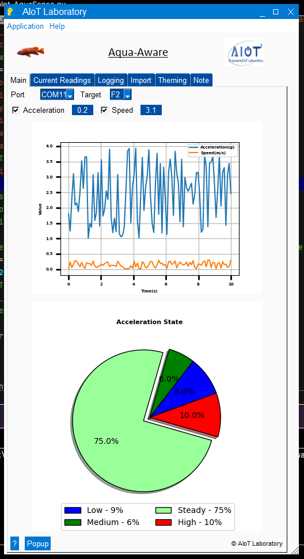

# Aqua-Aware: Real-Time Serial Data Monitoring & ML Prediction System
<p align="center">
  
</p>


This application, named "Aqua-Aware," is designed for real-time monitoring and analysis of sensor data with machine learning integration. The code implements a GUI-based system that:

1. Connects to serial devices (like Arduino, ESP32, STME32,  or custom sensors)
2. Processes multi-parameter input data (acceleration, speed, roll, pitch, yaw)
3. Applies machine learning predictions using a PyTorch model
4. Visualizes data through real-time plots and state distribution charts
5. Provides a user-friendly interface for monitoring and control

The system is targeted for monitoring motion or movement in underwater environments, likely for IoT or Underwater Internet of Things (UIoT) applications.

## Step-by-Step Implementation Process

### 1. Environment Setup

```markdown
- Install required Python libraries:
  - PySimpleGUI - For the graphical interface
  - matplotlib - For data visualization
  - numpy - For numerical operations
  - pyserial - For serial port communication
  - torch - For machine learning model support
  - PIL - For image processing
```

### 2. Model Implementation

```markdown
1. Define the PyTorch model architecture:
   - A placeholder model `PlaceholderObjectMonitorNet` is provided
   - The model accepts 5 input features (acc, speed, roll, pitch, yaw)
   - Outputs classification into 4 states: 'Low', 'Medium', 'Steady', 'High'

2. Implement model loading functionality:
   - Function to load a pre-trained PyTorch model
   - Includes handling for DataParallel models
   - Provides fallback predictor if model loading fails
```

### 3. GUI Setup

```markdown
1. Create the main window using PySimpleGUI with multiple tabs:
   - Main tab - Serial connection controls and live readings
   - Logging tab - Tabular data display
   - Output Log tab - System messages and debugging
   - Import tab - File/folder operations
   - Theming tab - Visual customization

2. Design input layout with:
   - Serial port selection dropdown
   - Baud rate input
   - Connect/Disconnect buttons
   - Real-time sensor value displays
   - Prediction state indicator
   - Visualization canvases for plots
```

### 4. Serial Data Processing

```markdown
1. Implement port detection:
   - Function `get_serial_ports()` to identify available serial ports
   - Platform-specific handling for Windows, Linux, and macOS

2. Create serial reading thread:
   - Connect to specified port with user-defined baud rate
   - Parse incoming data format: "Acc:0.2,Sp:3.1,Roll:1.5,Pitch:-0.8,Yaw:175.2"
   - Extract and validate all 5 required values
   - Handle errors and missing data gracefully
```

### 5. ML Prediction Integration

```markdown
1. Process each complete data point:
   - Convert parsed values to PyTorch tensor format
   - Pass data through loaded model
   - Extract prediction result
   - Update state counter and UI elements
   - Handle prediction errors

2. Implement prediction fallback:
   - Simple rule-based classification if model fails to load
   - Ensures system remains functional even without ML component
```

### 6. Data Visualization

```markdown
1. Implement real-time plotting:
   - Create dual-line plot for acceleration and speed
   - Configure matplotlib for embedded canvas display
   - Use deque for efficient rolling data storage

2. Create state distribution pie chart:
   - Track frequency of each predicted state
   - Update dynamically as new predictions arrive
   - Color-code different states for visual clarity
```

### 7. Multi-threading Implementation

```markdown
1. Serial reader thread:
   - Runs independently from main GUI thread
   - Communicates via event system and queue
   - Handles connecting, reading, and disconnecting from serial port

2. Plot updater thread:
   - Monitors data queue for new values
   - Updates visualization elements at specified intervals
   - Prevents UI blocking during intensive rendering
```

### 8. Event Handling

```markdown
1. Implement core event loop:
   - Handle connection/disconnection events
   - Process incoming serial data events
   - Update UI elements based on predictions
   - Manage visualization updates
   - Handle user interface interactions

2. Implement theme switching:
   - Allow user to select from PySimpleGUI themes
   - Reset and reconstruct interface with new theme
   - Maintain application state during theme changes
```

### 9. Deployment Considerations

```markdown
1. Package requirements:
   - Ensure all dependencies are properly installed
   - Replace placeholder model with actual trained model
   - Verify serial data format matches sensor output

2. Resource management:
   - Implement proper thread cleanup on exit
   - Handle serial port exceptions
   - Manage memory for visualization components
```

Okay, here's a breakdown of the application's purpose and a step-by-step explanation of the code implementation, including relevant code snippets.

## Purpose of the Application

This Python application, "Aqua-Aware," is designed as a **real-time monitoring system** that:

1.  **Connects to a Serial Device:** It reads data streamed over a serial port (e.g., from an Arduino or ESP32).
2.  **Parses Sensor Data:** It specifically expects incoming data lines containing **five features**: Acceleration (`Acc`), Speed (`Sp`), Roll, Pitch, and Yaw, likely in a key-value format (e.g., `Acc:0.5,Sp:1.2,...`).
3.  **Applies Machine Learning:** It uses a pre-trained **PyTorch neural network model** (`.pth` file) to analyze these five features.
4.  **Classifies State:** Based on the model's prediction, it classifies the state of the monitored object into predefined categories (`Low`, `Medium`, `Steady`, `High`).
5.  **Visualizes Data:**
    *   Displays the live numerical values for Acceleration and Speed.
    *   Shows the current predicted state label.
    *   Presents a real-time line graph plotting Acceleration and Speed values over time.
    *   Displays a pie chart showing the distribution of predicted states observed so far.
6.  **Provides a GUI:** Uses PySimpleGUI to offer a user-friendly interface for connection management, data viewing, and basic controls.
7.  **Ensures Responsiveness:** Employs threading to handle serial communication and plotting independently, preventing the GUI from freezing during data processing.
8.  **Includes Fallback:** Offers a basic rule-based predictor if the main PyTorch model cannot be loaded.

In short, it's a tool to acquire multi-sensor data, interpret it using a deep learning model, and visualize the results live.

## Step-by-Step Code Implementation Process

Here's how the code achieves the above purpose:

1.  **Import Libraries:** Necessary modules are imported for GUI, plotting, serial communication, ML, threading, data structures, etc.

    ```python
    import PySimpleGUI as sg
    import matplotlib.pyplot as plt
    from matplotlib.backends.backend_tkagg import FigureCanvasTkAgg
    import numpy as np
    import threading
    import time
    # import matplotlib.font_manager as fm # Not strictly used in final plots
    from PIL import Image
    import serial # <--- For serial communication
    # import joblib # Not used for PyTorch model loading
    import queue  # <--- For thread communication
    import collections # <--- For deque and Counter

    import torch # <--- Import PyTorch
    import torch.nn as nn # <--- Import base class for models
    ```

2.  **Configuration:** Global constants define key parameters like the model path, serial timeout, plot update rate, maximum plot points, expected number of input features, and the output class labels.

    ```python
    # --- Configuration ---
    MODEL_PATH = r'MLassistedObjectMonitoring.pth'
    SERIAL_TIMEOUT = 1
    PLOT_UPDATE_INTERVAL = 0.1
    MAX_PLOT_POINTS = 100
    NUM_FEATURES = 5 # <--- Define number of input features
    CLASS_LABELS = ['Low', 'Medium', 'Steady', 'High'] # --- MUST MATCH MODEL OUTPUT ORDER ---
    ```

3.  **PyTorch Model Definition & Loading:**
    *   A **placeholder** `nn.Module` class (`PlaceholderObjectMonitorNet`) is defined. **Crucially, this MUST be replaced with the actual Python class definition of your trained model's architecture.** It correctly uses `NUM_FEATURES` for the input layer and `len(CLASS_LABELS)` for the output.
    *   A function `load_pytorch_model` handles loading the model's saved state (`.pth` file), instantiating the correct architecture, handling potential saving quirks (like `DataParallel` prefixes), setting it to evaluation mode (`.eval()`), and includes error handling.

    ```python
    # --- !!! Placeholder Model Architecture !!! ---
    # --- !!! IMPORTANT: Replace this with your ACTUAL model definition !!! ---
    class PlaceholderObjectMonitorNet(nn.Module):
        def __init__(self, input_size=NUM_FEATURES, num_classes=len(CLASS_LABELS)): # <--- Use NUM_FEATURES
            super().__init__()
            # Example: A simple 2-layer linear network adjusted for input size
            self.layer_1 = nn.Linear(input_size, 64)
            self.relu = nn.ReLU()
            self.layer_2 = nn.Linear(64, num_classes)
            # ... (print warnings) ...

        def forward(self, x):
            # ... (forward pass definition) ...
            return x

    # --- !!! Function to Load PyTorch Model !!! ---
    def load_pytorch_model(model_path, model_definition_class, device='cpu'):
        """Loads a PyTorch model state_dict."""
        try:
            # Instantiate the ACTUAL model architecture
            model = model_definition_class(input_size=NUM_FEATURES, num_classes=len(CLASS_LABELS)) # <--- Use NUM_FEATURES
            # Load the saved weights
            state_dict = torch.load(model_path, map_location=torch.device(device), weights_only=True)
            # Handle potential 'module.' prefix
            # ... (prefix handling logic) ...
            model.load_state_dict(state_dict)
            model.eval() # Set to evaluation mode
            print(f"Successfully loaded PyTorch model from {model_path}")
            return model.to(device)
        except FileNotFoundError:
            # ... (error handling) ...
            return None
        except Exception as e:
            # ... (error handling) ...
            return None

    # --- Load the Model ---
    # Replace PlaceholderObjectMonitorNet with the actual class name of your network
    model = load_pytorch_model(MODEL_PATH, PlaceholderObjectMonitorNet)
    ```

4.  **Predictor Setup (ML or Fallback):**
    *   If the `model` loads successfully, a function `predictor_func` is defined. This function takes the 5 sensor values, converts them into a PyTorch tensor (`[1, 5]` shape), runs them through the model, finds the predicted class index (`torch.argmax`), and returns the corresponding label from `CLASS_LABELS`.
    *   If the model fails to load (`model is None`), a simple `FallbackPredictor` class is used, providing basic classification logic (likely just based on acceleration in this placeholder example).
    *   The `predictor` variable holds a reference to either `predictor_func` or an instance of `FallbackPredictor`.

    ```python
    # --- Fallback Predictor ---
    class FallbackPredictor:
        def __init__(self):
             print("WARNING: PyTorch model failed to load. Using fallback predictor.")
        def predict(self, acc_val, sp_val, roll_val, pitch_val, yaw_val): # <--- Accept all 5
            # Simple logic, still based on acceleration for this placeholder
            if acc_val < 0.1: return CLASS_LABELS[0]
            # ... (rest of fallback logic) ...

    if model is None:
        predictor = FallbackPredictor()
    else:
        # Predictor function now takes 5 arguments
        def predictor_func(acc_val, sp_val, roll_val, pitch_val, yaw_val): # <--- Accept all 5
            model.eval()
            with torch.no_grad(): # Disable gradient calculation for inference
                # 1. Convert inputs to PyTorch Tensor (shape [1, 5])
                input_data = [acc_val, sp_val, roll_val, pitch_val, yaw_val]
                input_tensor = torch.tensor([input_data], dtype=torch.float32)
                # 2. Get model output (logits)
                outputs = model(input_tensor)
                # 3. Get predicted class index
                predicted_index = torch.argmax(outputs, dim=1).item()
                # 4. Map index to label
                # ... (label mapping logic) ...
                return CLASS_LABELS[predicted_index] # Or "Unknown"
        predictor = predictor_func # Use the model-based function
    ```

5.  **Threading Setup:** An `Event` (`stop_event`) is created to signal threads to stop, and a `Queue` (`data_queue`) is created for safe data passing between the serial reader and plot updater threads.

    ```python
    # --- Thread Control ---
    stop_event = threading.Event()
    data_queue = queue.Queue()
    ```

6.  **GUI Definition (`make_window`):** This function defines the layout of the application window using PySimpleGUI elements.
    *   It includes menus, tabs (`sg.TabGroup`), text displays (`sg.Text`), input fields (`sg.Input`, `sg.Combo`), buttons (`sg.Button`), images (`sg.Image`), and crucially, `sg.Canvas` elements (`-ANIMATED_PLOT-`, `-CANVAS-`) which act as containers for the Matplotlib plots.
    *   It loads and resizes logos using PIL/Pillow.
    *   The window is created with `finalize=True` so that plot embedding can happen immediately.

    ```python
    def make_window(theme):
        sg.theme(theme)
        # ... (menu definitions, image loading/resizing) ...

        input_layout = [ # Layout for the 'Main' tab
            [sg.Text('Port'), sg.Combo(...k='-COMBO-'), sg.Text('Baud'), sg.Input(k='-BAUD-'),
             sg.Button('Connect', k='-CONNECT-'), sg.Button('Disconnect', k='-DISCONNECT-')],
            [sg.Checkbox('Acceleration'), sg.InputText(k='-TEXT2-'), # Live data display
             sg.Checkbox('Speed'), sg.InputText(k='-TEXT3-')],
            [sg.Text('Predicted State:'), sg.Text('N/A', k='-STATE-')], # Prediction display
            [sg.Text('Live Data Plot')],
            [sg.Canvas(size=(300, 200), key='-ANIMATED_PLOT-')], # Canvas for live plot
            [sg.Text('State Distribution')],
            [sg.Canvas(size=(300, 200), key='-CANVAS-')] # Canvas for pie chart
            # ... (other elements) ...
        ]
        # ... (layouts for other tabs: note_layout, logging_layout, etc.) ...

        layout = [[sg.MenubarCustom(...)],
                  [img1, sg.Text('Aqua-Aware', ...), img2], # Title and Logos
                  [sg.TabGroup([[sg.Tab('Main', input_layout),
                                 # ... (other tabs) ...
                                 sg.Tab('Output Log', note_layout)]], k='-TAB GROUP-')],
                  [sg.Sizegrip()]]

        window = sg.Window('AIoT Laboratory - Aqua-Aware', layout, ..., finalize=True)
        # ... (set min size) ...
        return window
    ```

7.  **Plotting Functions:**
    *   Global variables hold references to Matplotlib figures (`fig_live`, `fig_pie`), axes (`ax_live`, `ax_pie`), plot lines (`acc_line`, `sp_line`), and the embedded canvas objects (`fig_agg_live`, `fig_agg_pie`).
    *   `collections.deque(maxlen=...)` is used for `time_data`, `acc_data`, `sp_data` to efficiently store the last `MAX_PLOT_POINTS` for the live graph.
    *   `collections.Counter()` (`state_counts`) stores the frequency of each predicted state for the pie chart.
    *   `draw_figure`: Helper to embed a Matplotlib figure onto a `sg.Canvas`.
    *   `setup_live_plot`: Creates the initial empty Matplotlib line plot, sets labels/legends, and uses `draw_figure` to place it on the `-ANIMATED_PLOT-` canvas.
    *   `update_live_plot_data`: Takes data from the `deque`s, updates the `.set_data()` of the plot lines (`acc_line`, `sp_line`), autoscales axes, and redraws the plot canvas (`fig_agg_live.draw()`).
    *   `setup_pie_chart`: Creates the initial empty Matplotlib pie chart axes and embeds it on the `-CANVAS-` element.
    *   `update_pie_chart_display`: Clears the previous pie, gets data from `state_counts`, calculates percentages, draws the new pie chart (`ax_pie.pie(...)`), and redraws its canvas (`fig_agg_pie.draw()`).

    ```python
    # Global references for plots and data storage
    fig_agg_live = None; fig_live = None; ax_live = None; acc_line = None; sp_line = None
    time_data = collections.deque(maxlen=MAX_PLOT_POINTS)
    acc_data = collections.deque(maxlen=MAX_PLOT_POINTS)
    sp_data = collections.deque(maxlen=MAX_PLOT_POINTS)
    # ... (similar globals for pie chart: fig_agg_pie, fig_pie, ax_pie) ...
    state_counts = collections.Counter() # For pie chart data

    def draw_figure(canvas, figure):
        # ... (embeds figure in canvas using FigureCanvasTkAgg) ...
        return figure_canvas_agg

    def setup_live_plot(window):
        global fig_agg_live, fig_live, ax_live, acc_line, sp_line
        canvas_elem = window['-ANIMATED_PLOT-']
        canvas = canvas_elem.TKCanvas
        fig_live, ax_live = plt.subplots(...)
        acc_line, = ax_live.plot([], [], 'r-', label='Acc (g)', ...) # Initial empty line
        sp_line, = ax_live.plot([], [], 'b-', label='Speed (m/s)', ...) # Initial empty line
        # ... (set labels, legend, grid) ...
        fig_agg_live = draw_figure(canvas, fig_live) # Embed in GUI

    def update_live_plot_data():
        # ... (check if plot exists) ...
        current_time = list(time_data); current_acc = list(acc_data); current_sp = list(sp_data)
        acc_line.set_data(current_time, current_acc) # Update line data
        sp_line.set_data(current_time, current_sp)  # Update line data
        ax_live.relim(); ax_live.autoscale_view(True,True,True) # Rescale axes
        fig_agg_live.draw() # Redraw the plot

    # ... (Similar setup_pie_chart and update_pie_chart_display functions) ...
    ```

8.  **Serial Reader Thread (`serial_reader`):**
    *   Runs in a separate thread to avoid blocking the GUI.
    *   Opens the specified serial port. Sends events (`-SERIAL_CONNECTED-` or `-SERIAL_ERROR-`) back to the main GUI thread via `window.write_event_value()`.
    *   Enters a loop that continues as long as `stop_event` is not set.
    *   Reads lines from the serial port (`ser.readline()`).
    *   **Parses** the incoming line, expecting the 5 features (Acc, Sp, Roll, Pitch, Yaw) in a specific key:value format. Extracts the float values. Includes error handling for malformed lines.
    *   **Predicts:** Calls the `predictor` (either ML or fallback) with the 5 extracted values.
    *   **Updates State Counts:** Increments the count for the `predicted_state` in the global `state_counts`. If the state changed, it sends an `-UPDATE_PIE-` event to the main thread.
    *   **Sends Data to GUI:** Packages all relevant data (all 5 features + state) into a dictionary and sends it to the main thread using `window.write_event_value('-SERIAL_DATA-', data_payload)`.
    *   **Sends Data to Plot:** Puts only the necessary data for the live plot (`time`, `acc`, `sp`) onto the `data_queue`.
    *   Handles exceptions and ensures the port is closed upon exit. Sends `-SERIAL_DISCONNECTED-`.

    ```python
    def serial_reader(window: 'sg.Window', port: str, baud: int, predictor_obj, stop_flag: threading.Event, data_q: queue.Queue):
        # ... (setup, print messages) ...
        ser = None
        try:
            ser = serial.Serial(port, baud, timeout=SERIAL_TIMEOUT)
            window.write_event_value('-SERIAL_CONNECTED-', True) # Signal success
            while not stop_flag.is_set():
                if ser.in_waiting > 0:
                    try:
                        line = ser.readline().decode('utf-8', errors='ignore').strip()
                        # --- Parsing Logic for 5 features ---
                        # Example: "Acc:0.2,Sp:3.1,Roll:1.5,Pitch:-0.8,Yaw:175.2"
                        parsed_data = {}
                        parts = line.split(',')
                        # ... (loop through parts, split by ':', try float conversion) ...
                        # --- Check if all expected keys were found ---
                        if valid_line and expected_keys.issubset(parsed_data.keys()):
                            acc_val = parsed_data['Acc'] # etc. for sp, roll, pitch, yaw
                            # --- ML Prediction ---
                            predicted_state = predictor_obj(acc_val, sp_val, roll_val, pitch_val, yaw_val)
                            # --- Update State Counts ---
                            state_counts[predicted_state] += 1
                            if predicted_state != last_state:
                                window.write_event_value('-UPDATE_PIE-', True) # Signal pie update needed
                            # --- Send full data to main thread ---
                            data_payload = {'acc': acc_val, 'sp': sp_val, 'state': predicted_state, ...}
                            window.write_event_value('-SERIAL_DATA-', data_payload) # Signal GUI update
                            # --- Put data onto queue for live plot ---
                            data_q.put({'time': sample_count, 'acc': acc_val, 'sp': sp_val})
                    # ... (exception handling for reading/parsing) ...
                else:
                    time.sleep(0.01) # Prevent busy-waiting
        except serial.SerialException as e:
            window.write_event_value('-SERIAL_ERROR-', str(e)) # Signal error
        # ... (finally block to close port and signal disconnect) ...
            window.write_event_value('-SERIAL_DISCONNECTED-', True)
    ```

9.  **Plot Updater Thread (`plot_updater`):**
    *   Also runs in a separate thread.
    *   Continuously checks the `data_queue` for new data points (put there by `serial_reader`).
    *   Uses `data_q.get_nowait()` to retrieve data without blocking.
    *   Appends the received `time`, `acc`, and `sp` values to the respective `deque`s.
    *   If new data was added, it calls `update_live_plot_data()` to trigger a redraw of the live graph in the main thread's context (Matplotlib drawing should ideally happen in the main thread, although this simplified approach often works).
    *   Sleeps briefly (`PLOT_UPDATE_INTERVAL`) to control the update frequency.

    ```python
    def plot_updater(stop_flag: threading.Event, data_q: queue.Queue):
        while not stop_flag.is_set():
            try:
                new_data_available = False
                while not data_q.empty(): # Get all data currently in queue
                    data_point = data_q.get_nowait()
                    time_data.append(data_point['time'])
                    acc_data.append(data_point['acc'])
                    sp_data.append(data_point['sp'])
                    new_data_available = True
                if new_data_available:
                    update_live_plot_data() # Request redraw
                time.sleep(PLOT_UPDATE_INTERVAL) # Pause
            # ... (exception handling) ...
    ```

10. **Utility (`get_serial_ports`):** A standard helper function to list available serial ports on the system.

11. **Main Application (`main`):**
    *   Creates the main window using `make_window`.
    *   Initializes the plots using `setup_pie_chart` and `setup_live_plot`.
    *   Enters the main **event loop** (`window.read()`).
    *   **Handles Events:**
        *   `sg.WIN_CLOSED` or `'Exit'`: Sets `stop_event`, breaks the loop.
        *   `'-CONNECT-'`: Stops any existing threads, clears old data/plots, creates and starts new `serial_reader` and `plot_updater` threads.
        *   `'-DISCONNECT-'`: Sets `stop_event`.
        *   `'-SERIAL_DATA-'` (sent from `serial_reader`): Receives the data payload, updates the `sg.InputText` and `sg.Text` elements (`-TEXT2-`, `-TEXT3-`, `-STATE-`) in the GUI.
        *   `'-UPDATE_PIE-'` (sent from `serial_reader`): Calls `update_pie_chart_display()`.
        *   `'-SERIAL_CONNECTED-'`, `'-SERIAL_DISCONNECTED-'`, `'-SERIAL_ERROR-'` (sent from `serial_reader`): Updates button enable/disable states, shows popups, resets GUI fields.
        *   Other GUI events (button clicks, menu items): Executes corresponding actions (popups, progress bars, etc.). Theme changes involve restarting the application by closing and recreating the window.
    *   **Cleanup:** After the loop ends, sets `stop_event` and uses `thread.join()` to wait for threads to finish cleanly before closing the window.

    ```python
    def main():
        # ... (setup window, plots) ...
        serial_thread = None; plot_thread = None; is_connected = False

        while True: # Main event loop
            event, values = window.read(timeout=100) # Read GUI events

            if event == sg.WIN_CLOSED or event == 'Exit':
                stop_event.set() # Signal threads to stop
                break

            # --- Serial Connection Handling ---
            if event == '-CONNECT-':
                # ... (stop old threads, clear data, start new threads) ...
                serial_thread = threading.Thread(target=serial_reader, args=...)
                plot_thread = threading.Thread(target=plot_updater, args=...)
                serial_thread.start(); plot_thread.start()

            elif event == '-DISCONNECT-':
                stop_event.set()

            # --- Events from Serial Thread ---
            elif event == '-SERIAL_DATA-': # Update GUI with received data
                acc = values[event]['acc']; sp = values[event]['sp']; state = values[event]['state']
                window['-TEXT2-'].update(f"{acc:.2f}")
                window['-TEXT3-'].update(f"{sp:.2f}")
                window['-STATE-'].update(f"{state}")

            elif event == '-UPDATE_PIE-': # Update pie chart when state changes
                update_pie_chart_display()

            elif event == '-SERIAL_CONNECTED-': # Update GUI on successful connection
                # ... (disable connect, enable disconnect, disable combo/baud) ...
                is_connected = True

            elif event == '-SERIAL_DISCONNECTED-' or event == '-SERIAL_ERROR-': # Update GUI on disconnect/error
                # ... (enable connect, disable disconnect, enable combo/baud, reset text) ...
                is_connected = False
                if event == '-SERIAL_ERROR-': sg.popup_error(...)

            # --- Other GUI Events ---
            elif event == 'About': sg.popup(...)
            # ... (handle other button clicks, menu items, theme changes) ...

        # --- Cleanup ---
        print("[LOG] Waiting for threads to finish...")
        stop_event.set() # Ensure flag is set
        if serial_thread and serial_thread.is_alive(): serial_thread.join(timeout=2)
        if plot_thread and plot_thread.is_alive(): plot_thread.join(timeout=2)
        window.close()
    ```

12. **Execution:** The `if __name__ == '__main__':` block sets the initial theme and calls `main()` to start the application.

    ```python
    if __name__ == '__main__':
        # Ensure torch is installed: pip install torch
        # REMEMBER TO REPLACE PlaceholderObjectMonitorNet with your actual model class
        sg.theme('Material1')
        main()
    ```

